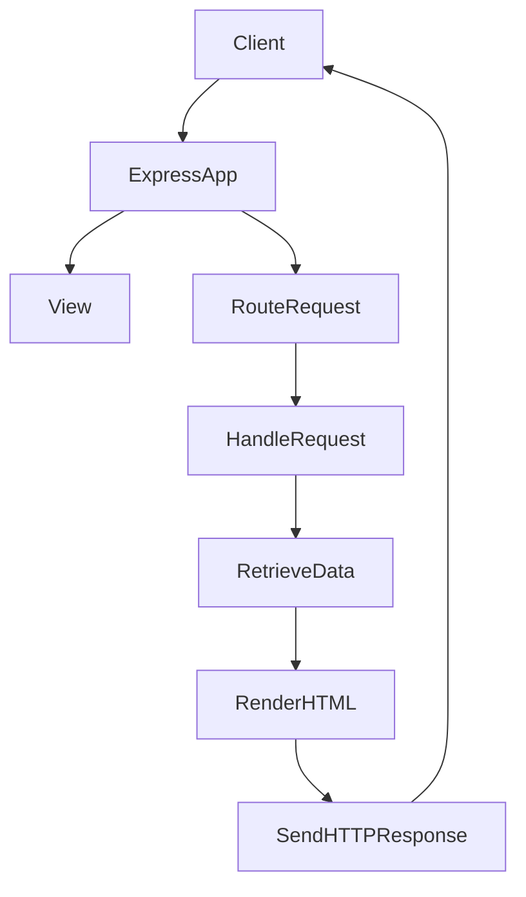
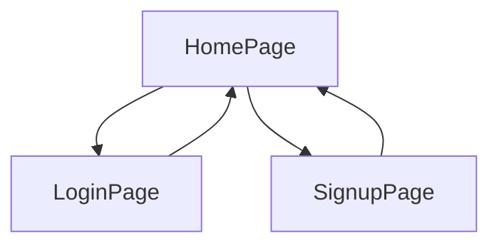
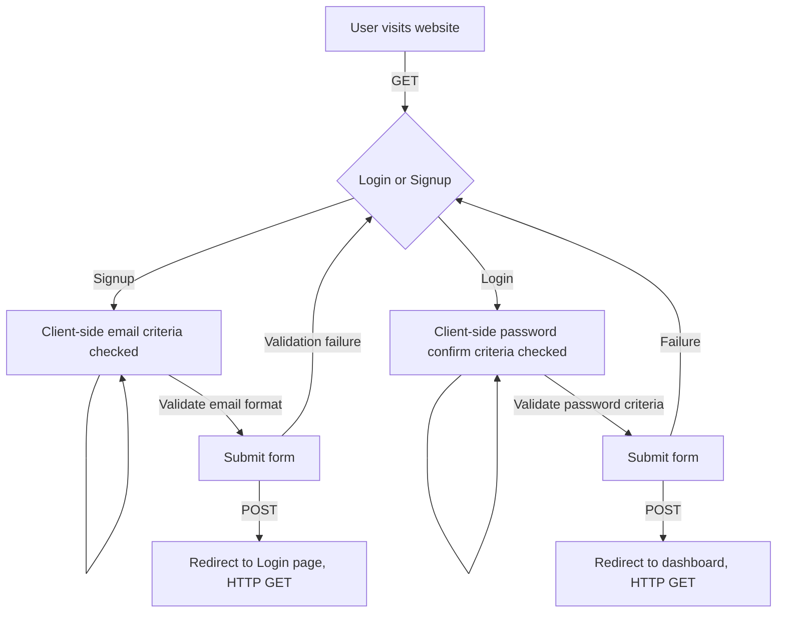

# H446-03 – PROJECT CONTENTS <!-- omit from toc -->

## TABLE OF CONTENTS <!-- omit from toc -->

- [Introduction: 1.0](#introduction-10)
  - [Overview of the 11 Plus Examination 1.1](#overview-of-the-11-plus-examination-11)
    - [Content of the Exam 1.1.2](#content-of-the-exam-112)
    - [Who Takes It and Where? (Stakeholders) 1.1.3](#who-takes-it-and-where-stakeholders-113)
    - [Why It's a Big Deal 1.1.4](#why-its-a-big-deal-114)
    - [The reason to select this competition test exam 1.1.5](#the-reason-to-select-this-competition-test-exam-115)
- [ANALYSIS 2.0](#analysis-20)
  - [Problem identification 2.1](#problem-identification-21)
  - [Introduction of Proposed Solution and Stakeholder Needs 2.2](#introduction-of-proposed-solution-and-stakeholder-needs-22)
  - [Describing and Justifying Computational Approach](#describing-and-justifying-computational-approach)
  - [Identifying and Justifying Specific Features](#identifying-and-justifying-specific-features)
  - [How to implement the Proposed Solution](#how-to-implement-the-proposed-solution)
  - [Limitations of the proposed Solution](#limitations-of-the-proposed-solution)
  - [Justifying Hardware and Software Choices](#justifying-hardware-and-software-choices)
  - [Identifying and justifying measurable success criteria for the proposed solution](#identifying-and-justifying-measurable-success-criteria-for-the-proposed-solution)
  - [Requirements for such a project](#requirements-for-such-a-project)
    - [Why Node.js?](#why-nodejs)
    - [How a simple nodejs server is created?](#how-a-simple-nodejs-server-is-created)
    - [MVC ( MOdel-View-Controller) architecture](#mvc--model-view-controller-architecture)
    - [Key Principles](#key-principles)
- [Project Application Design](#project-application-design)
  - [Design: Part-A](#design-part-a)
  - [Design Part-B](#design-part-b)
- [Implementation of the design Part-A](#implementation-of-the-design-part-a)
  - [Starting project application setup](#starting-project-application-setup)
    - [Setting up express nodejs framework](#setting-up-express-nodejs-framework)
    - [Generating the application skeleton](#generating-the-application-skeleton)
    - [Initialising git and linking it to the GitHub repo](#initialising-git-and-linking-it-to-the-github-repo)
  - [Analysing the express skeleton structure](#analysing-the-express-skeleton-structure)
    - [Interrogating the functionality of the www Script](#interrogating-the-functionality-of-the-www-script)
    - [Examining app.js code](#examining-appjs-code)
    - [What lies under views folder ?](#what-lies-under-views-folder-)
    - [Examining route folder ?](#examining-route-folder-)
  - [Implementing Design Part-A Logic Step-1: Creating Home Page](#implementing-design-part-a-logic-step-1-creating-home-page)
    - [Analysing the above code and creating new folders](#analysing-the-above-code-and-creating-new-folders)
    - [Creating homepage header](#creating-homepage-header)
    - [Applying styles to home page using styles.css](#applying-styles-to-home-page-using-stylescss)
    - [Applying bootstrap icons in header](#applying-bootstrap-icons-in-header)
    - [Adding Login and Signup pages](#adding-login-and-signup-pages)
  - [Implementing Design Part-A Logic Step-2: Setting up Database locally and online](#implementing-design-part-a-logic-step-2-setting-up-database-locally-and-online)
    - [Adding a user schema for the database](#adding-a-user-schema-for-the-database)
    - [Handling incoming POST request when submit button is pressed](#handling-incoming-post-request-when-submit-button-is-pressed)
- [What is Progressive Web Application?](#what-is-progressive-web-application)
  - [Creating mongodb account](#creating-mongodb-account)
  - [How to clone this repository on local machine](#how-to-clone-this-repository-on-local-machine)
  - [References](#references)
    - [Compiled list of 11+ Websites](#compiled-list-of-11-websites)
- [Appendix-A](#appendix-a)
  - [Vscode extension used](#vscode-extension-used)
- [Appendix-B](#appendix-b)

<div class="page"/>
## Introduction: 1.0

### Overview of the 11 Plus Examination 1.1

The 11 plus, or Eleven Plus, exam is a big deal for children in England and Northern Ireland when they're about 11 years old. It's like a ticket to selective secondary schools, such as grammar schools and some private ones.

#### Content of the Exam 1.1.2

Depending on where you take it, the test covers `English, Math, verbal reasoning, and non-verbal reasoning`. It's all about seeing how well one can solve problems and show better cognition abilities.

#### Who Takes It and Where? (Stakeholders) 1.1.3

The number of children taking the 11-plus exams changes a lot depending on where you are in the UK. Some places still use it to decide who gets into certain schools, but others have different systems.

#### Why It's a Big Deal 1.1.4

People talk a lot about the 11-plus because it's seen as a big deal for children's futures. A better School means a better education one gets and more chances available to learn and compete with the elite class in the future where thousands of pounds fee is required.

#### The reason to select this competition test exam 1.1.5

I have undertaken this examination, as has one of my sisters. Within our community, it enjoys considerable popularity, with numerous students competing for placements in esteemed grammar schools. Presently, freely accessible practice materials are scarce online. While various websites, such as [Bond 11 Plus](https://www.bond11plus.co.uk) offer packages for online practice via their digital platforms, they typically require purchase. However, some platforms, like [11 Plus Guide](https://www.11plusguide.com) permit the download of sample papers for manual practice. Additionally, I have [compiled a list](#compiled-list-of-11-websites) of other relevant online resources, along with several books and papers available in my personal collection. Notably, one of the frequently consulted books is published by NelSon-Thrones of Oxford University Press[^1](#references).

The diverse content covered in the aforementioned examination offers significant opportunities for an A-level project student to develop either a digital website or a mobile application platform. These platforms would enable 11+ students to engage in online practice sessions for the examinations at no cost. Given the extensive range of subjects covered, including English language, Mathematics, and reasoning, the project's scope is vast and cannot be fully addressed within its confines. As such, I have elected to focus solely on Verbal Reasoning for the purpose of this project

<div class="page"/>

## ANALYSIS 2.0

### Problem identification 2.1

The prevailing challenge in this area lies in the scarcity of accessible and comprehensive resources for students preparing for the 11+ Exams. While traditional textbooks exist, they often lack interactivity and cost-effectiveness in digital formats. Furthermore, existing platforms typically require students to purchase packages, limiting access based on financial constraints. There  exist  no platform where those who can contribute time and resources  to help  11+ students digitally as no such repository online is present.

### Introduction of Proposed Solution and Stakeholder Needs 2.2

To address this issue, a proposed solution focuses on creating a robust digital platform specifically tailored for 11+ Verbal Reasoning practices. While other areas may be equally important, this project intentionally focuses solely on Verbal Reasoning to remain within the scope of an A-Level project. Here are the key features and benefits of this solution:

1. **Comprehensive Content**: The platform will offer a curated selection of Verbal Reasoning exercises, covering various question types encountered in the 11+ Exams. By concentrating on Verbal Reasoning, we ensure depth and specificity, allowing students to enhance their critical thinking and language skills effectively.

2. **Interactive Learning**: Unlike static textbooks, the digital solution will provide an engaging experience. Students can actively participate in solving problems, receive instant feedback, and track their progress including timed challenges, detailed explanations, and helpful hints, which will enhance the learning experience."

3. **Cost-Free Access**: The commitment to accessibility means that all content will be available to students at no cost. By eliminating the need for expensive subscriptions or purchases, a wider audience can benefit from the platform.

4. **Mobile-Friendly**: Recognizing the prevalence of handheld devices, the platform will be designed for seamless use on mobile phones and tablets. Students can practice Verbal Reasoning questions anytime, anywhere, without desktop constraints. Additionally, the solution will be optimized for both online and offline modes, ensuring uninterrupted learning even in areas with limited internet connectivity.

5. **Collaborative Repository**: Beyond content consumption, the platform will foster collaboration. Educators, programmers, and subject matter experts can contribute additional materials, share insights, and enhance the repository. For instance, psychology professionals could design exercises to improve memory and cognition, while educators with expertise in focus enhancement strategies could contribute valuable insights.

6. **Analytical Solutions**: In addition to practice exercises, the platform will offer analytical solutions. Students can explore detailed explanations, learn problem-solving techniques, and gain deeper insights into the reasoning behind correct awers. This analytical approach encourages a holistic understanding of Verbal Reasoning concepts.

In summary, the proposed solution aims to bridge the gap by providing a free, interactive, and comprehensive digital platform exclusively focused on Verbal Reasoning practice for 11+ Exams. Leveraging technology, collaboration, and accessibility, this initiative seeks to empower students on their educational journey. This solution is not going to be a static website built by any Static Site Generators


[//]: # (After engaging in discussions with stakeholders, including students, parents, and educators, and reflecting on my personal experience of taking these exams, it has become evident that there is a significant demand for accessible, engaging, and effective resources for 11+ exam preparation. To support this assertion, I offer an example from my own family, wherein my parents sought to provide us with ample assistance. However, as previously mentioned, both my sister and I encountered challenges in accessing the necessary support, highlighting the existing gap in available resources.)

### Describing and Justifying Computational Approach

1. Verbal Reasoning questions are inherently structured and can be systematically analysed by computational methods.
2. Computational methods allow for the creation of dynamic and interactive question formats, personalized practice sessions, and adaptive learning experiences tailored to individual student needs.
3. Additionally, computational approaches enable the scalability and accessibility of the solution, making it available to a wide audience regardless of geographical location or socioeconomic status.
4. By leveraging computational methods, we can automate the generation of practice questions, provide instant feedback to students, and track their progress over time, enhancing the effectiveness and efficiency of exam preparation.
5. By integrating computational methods into the solution, we can harness the power of technology to address the challenges of 11+ exam preparation, making it more engaging, accessible, and personalized for students.

### Identifying and Justifying Specific Features

1. Comprehensive coverage of Verbal Reasoning topics.
2. Designing interactive question formats dynamically using JavaScript in conjunction with HTML and CSS.
3. These question formats can include  `multiple-choice, matching, fill-in-the-blank, underlining, choosing words from groups and pairs`.
4. More complex question formats can be designed for example presenting users with more than two categories and asking them to select a number of words belonging to a specific category.
5. -> Personalized practice sessions based on individual performance and areas of improvement.
6. -> Progress tracking and performance analytics for students and parents.

[//]: # ( delete which can not be implemented )

### How to implement the Proposed Solution

1. Technologies such as HTML, CSS, and Bootstrap will be used on front end taking care of the user interface (UI capabilities) while the back-end support will be provided using nodeJs technology and its vast libraries to provide server support. NPM is be used to handle project structure and installation of node modules.
2. Templating engine will also be used to ease the job of reinventing the wheel when it comes to write HTML code.JavaScript will be used to handle the computational logic, for example, to find out if the selected answers are correct or wrong. It can also be used in reading the contents from the JSON files where practice and mock data can be stored and rendered.
3. To ease the work of nodejs, one of its module `express` will be used. Though other framework like React among many  can be used.
4. When it comes to creating the contents of the test or exercises to be practice, two approaches are possible one is to dynamically create all the contents by using JavaScript or designing the user interface and providing placeholders to be filled by JavaScript logic.
5. Sound files can be used to indicate the success or failure to engage the students in more interactive ways.
6. Similarly data can be stored in JSON format which is the most popular choice when handled by JavaScript libraries.
7. Since it is promised to provide the solution available to hand-held devices to all available devices. No specific technologies for designing a mobile app will be used such as Swift for ios or Java for android.
8. The purposed solution uses Progressive Web Apps (PWAs) which provide a mobile app-like experience. They can be accessed through a web browser but offer features like installation on mobile devices, offline support, push notifications and home screen installation.
9. The digital solution is planned to be written in a Git repository which can be shared on an open collaborative platform such as [GitHub](https://github.com) or [GitLab](https://gitlab.com) enabling others to participate and improve the content.
10. The solution will be hosted on cloud servers to ensure scalability and accessibility from any device with an internet connection.
11. To store users credentials Mongodb non sql data base is selected. An online database will be created for this purpose using MongoDB atlas services.
12. Compatibility with various devices, including desktops, laptops, tablets, and smartphones, will be ensured through responsive design using bootstrap.
13. The platform will prioritize user-friendly interfaces and optimize performance for seamless user experience across different hardware and software configurations.

### Limitations of the proposed Solution

1. While much has been proposed as a potential solution, several challenges lie ahead, particularly in tailoring the website or app for personalized use. This entails the incorporation of distinct logic for each individual user and the secure storage of their credentials within the database.
2. Providing parents with the ability to monitor their children's progress necessitates the implementation of separate user accounts for students and parents. Furthermore, establishing a connection between these accounts while maintaining privacy requires careful consideration to ensure that sensitive data remains concealed.
3. I plan to commence the project with a focus on simplicity to meet the requirements outlined in H446 OCR A Level Computer Science (NEA: Non-exam assessment). This approach will allow for a gradual progression, ensuring that the project remains manageable and aligned with the specified criteria.

### Justifying Hardware and Software Choices

**What technologies are needed for a developer**:

The hardware technologies required for a developer to create websites or PWAs do not necessitate specialized hardware, unlike certain machine learning applications that demand specific computational power. Instead, a standard desktop or laptop with operating systems such as Windows 10/11, Ubuntu (Linux distribution), or macOS on Apple machines will suffice. As for software selection, I plan to utilize the following tools.

1. [Vscode](https://code.visualstudio.com/) to write the code.
2. [Microsoft Windows Terminal](https://apps.microsoft.com/detail/9n0dx20hk701?rtc=1&hl=en-gb&gl=GB) to interact with git.
3. [PickPick](https://picpick.app/) to get the snapshot of the website.
4. [Chrome Browser](https://www.google.com/chrome/) to display the result.
5. [Node.js and npm](https://nodejs.org/) to provide server side handling.
6. [Git](https://git-scm.com/) to keep track the record of the repository.
7. [GitHub](https://github.com/) to upload the repository on the clouds and free hosing.

### Identifying and justifying measurable success criteria for the proposed solution

1. The success of the proposed website can be measured through various quantifiable criteria that directly reflect its effectiveness in addressing the identified problem and meeting stakeholder needs.
2. Firstly, the website's user engagement metrics, such as the number of active users, session duration, and frequency of visits, can serve as indicators of its popularity and usefulness among students, parents, and other users.
3. Secondly, the completion rates of practice sessions and quizzes within the website will gauge the extent to which users are actively utilizing its resources for exam preparation.
4. Thirdly, user satisfaction surveys and feedback mechanisms can provide valuable insights into the perceived value, usability, and overall satisfaction with the website's features and functionality.
5. By establishing these measurable success criteria, we can objectively evaluate the impact and effectiveness of the website in supporting 11+ exam preparation and achieving its intended goals.

<div class="page"/>

### Requirements for such a project

1. Websites typically follow a client-server architecture, where the client refers to the user's web browser (such as Chrome, Firefox, or Safari), and the server refers to a remote computer that hosts the website's files and data. When a user visits a website, their browser sends a request to the server, asking for the website's content. These request uses HTTP verbs such as `GET` method for the page navigation.
2. Similarly when a user submits a form on a webpage (such as a login form, registration form, or search form), the browser sends a request to the server to process the form data. This request can use either the HTTP GET or POST method, depending on the form's configuration and the type of data being submitted.
3. Web pages often contain resources such as images, stylesheets, scripts, and fonts that are loaded asynchronously from the server. Each of these resources triggers a separate request to the server, allowing the browser to fetch and render them independently while the rest of the page loads.
4. Modern web applications frequently interact with remote APIs (Application Programming Interfaces) to retrieve data, perform actions, or integrate with external services. These API requests can be initiated from the client side using various techniques, such as AJAX, the fetch API, or client-side libraries/frameworks.
5. All the above usually refers to a term commonly known as `Client/Server` architecture.  
6. **Client-Side Activities**: Client-side activities refer to tasks and operations that are performed within the user's web browser. This includes rendering HTML, executing JavaScript code, and handling user interactions such as clicks and form submissions. Client-side activities are responsible for creating the user interface and providing interactivity to the user.
7. **Server-Side Activities**: Server-side activities, on the other hand, are performed on the server, typically using server-side technologies like Node.js. These activities include processing user requests, executing business logic, interacting with databases, and generating dynamic content. Server-side activities are responsible for handling the backend operations of the application, such as user authentication, data validation, and database management.
8. **Role of Node.js in Client-Server Communication**:Node.js plays a crucial role in facilitating communication between the client-side and server-side components of web applications. It serves as the backend infrastructure for handling client requests, processing data, and sending responses back to the client. By leveraging the power of Node.js, developers can build fast, scalable, and real-time web applications that deliver a seamless user experience across different devices and platforms.

#### Why Node.js?

1. **JavaScript Everywhere**: With Node.js, developers can use JavaScript for both client-side and server-side development, enabling a consistent and unified codebase.
2. **Event-Driven Architecture**: Node.js utilizes an event-driven, non-blocking I/O model, which allows for efficient handling of concurrent requests and real-time applications.
3. **Vibrant Ecosystem**: Node.js has a large and active community, providing a wealth of libraries and tools to streamline development.
4. **Scalability**: Node.js applications can easily scale to handle large numbers of concurrent connections, making it suitable for building robust and scalable web applications.

#### How a simple nodejs server is created?

The following code creates  a simple nodejs server that is run locally for developing environment.

```js
// Import the 'http' module
const http = require('http');
// Define the hostname and port number
const hostname = '127.0.0.1';
const port = 3000;
// Create a server
const server = http.createServer((req, res) => {
  // Set the response status and headers
  res.statusCode = 200;
  res.setHeader('Content-Type', 'text/plain');
  // Send the response
  res.end('Hello, World!\n');
});
// Start the server and listen for incoming requests
server.listen(port, hostname, () => {
  console.log(`Server running at http://${hostname}:${port}/`);
});

```

The above code does the followings:

1. Require the built-in http module, which provides functionality for creating HTTP servers using `const http = require('http');`. Declaring some variables for the port and hostname and assigned them some values.
2. Uses the `http.createServer()` method to create a server instance. Pass a callback function to handle incoming requests.
3. Within the callback function, handle incoming HTTP requests. This involves reading request data, processing it, and sending back a response.
4. Specify the port number on which the server should listen for incoming requests.

Similarly the same can be done using a nodejs module called `express` since it provides number of functionalities to ease the job it is also known as express framework. Following code shows how the same job is done using express module.

```js
// Import the Express framework
const express = require('express');
// Create an Express application
const app = express();
// Define a route handler for the root path
app.get('/', (req, res) => {
  // Send a response
  res.send('Hello, World!\n');
});
// Define the port number
const port = 3000;
// Start the server and listen for incoming requests
app.listen(port, () => {
  console.log(`Server running on port ${port}`);
});
```

If we see the above code closely there is not much difference except that express module is used and GET request is handled by a route. This is not we intend to achieve from express but we want our code to be modular and properly structured. For this purpose we use an MVC ( modal view controller ) architecture where components of a websites are treated separately.

#### MVC ( MOdel-View-Controller) architecture

1. it is a design pattern commonly used in software development to organize code and separate concerns.
2. **Model**: The model represents the data and business logic of the application. It encapsulates the application's data and defines how it can be manipulated.In a database-driven web application, models often interact with the database to perform CRUD (Create, Read, Update, Delete) operations.View.
3. **View**: The view is responsible for presenting the user interface and displaying data to the user. It renders the model's data in a format suitable for presentation, such as HTML, XML, or JSON. Views are typically passive components that receive data from the controller and display it to the user.
4. **Controller**: The controller acts as an intermediary between the model and the view. It handles user input and updates the model accordingly. Controllers contain the application's business logic, process user requests, and determine which view to render in response.

- Following is a basic flow of an Express application



#### Key Principles

1. Separation of Concerns: MVC separates the application logic into distinct components, making it easier to understand, maintain, and extend.
2. Modularity: Each component (model, view, controller) can be developed, tested, and modified independently, promoting code reusability and scalability.
3. Flexibility: MVC allows for flexible interaction between components, enabling developers to change one component without affecting others.
4. Scalability: The modular structure of MVC facilitates the development of large-scale applications by dividing them into manageable parts.

Overall, MVC architecture provides a robust foundation for building complex software systems by promoting separation of concerns, modularity, and flexibility. It remains a popular choice for developing web applications due to its clear structure and well-defined responsibilities for each component. For this reason I have decided to use this pattern and develop this project.

<div class="page"/>

## Project Application Design

It is to be designed in a local repository which can be linked to online server. Since the project application promises to provide the full functional website as a digital platform hosted in a cloud server, its design and implementation consist of many steps. It is divided into four design parts, design part-A design part-B and so on. They are further divided into different steps.

1. Design Part-A consist of making a user interface then providing interaction between them and testing the website.
2. Design Part-B consist of making the website to work as [PWA](https://developer.mozilla.org/en-US/docs/Web/Progressive_web_apps/Guides/What_is_a_progressive_web_app). 

### Design: Part-A

**Step-1**: The website shows an interface to the user to interact with so that one can login or register. Here a GUI ( Graphical User Interface ) for this purpose is designed.



These three pages initial sketch is designed and  shown in the following diagram.

<br>
*figure-1*

**Step-2**: Adding a database to store and retrieve the user data locally and online. [Mongodb](https://www.mongodb.com/) database is chosen for this purpose.

**Step-3**: Make its part interactive so that communication is enabled among different pages using HTTP protocol. Following flow diagram shows such an interaction which happens through this protocol.




**Step-4**: It is to be tested to make sure it passes all HTTP requests made by the user, to do so either [Postman](https://www.postman.com/),[insomnia](https://insomnia.rest/) or Vscode extension name [thunderclient](https://www.thunderclient.com/) will be used to design, debug and test APIs.

---

### Design Part-B

**Step-1**: The website is to be implemented as Progressive Web application and tested on hand-held devices. It has to pass full criteria to be the candidate for PWA. Testing is to be done using available technologies.

- Write down what is to come here ! 

- At first we only design the user interface for the user to login or register to the website.the site to provide us the working websites that includes a home page providing the option of `Login` and `Signup` facilities. Once this stage is passed, testing is done,we will continue to the next stage.
- The project also promises that such a project should be used on mobile devices, thus it would try to achieve this functionality using Progressive Web App technologies before going to the next stage.

---

## Implementation of the design Part-A

- As discussed above we are to use the MVC architecture of express node module. In MVC architecture `views` represents the interface or the webpages that user can interact with. When users presses or clicks on these interfaces client initiates the request to navigate to a different page, this requests is handled by the MVC architecture using `routes`. Similarly what is to be done in response to the request can be handled by the `controller` components.
- Express frame work makes our job easy to keep all these components of the web developing environment by providing us separate folders to keep the work modular while working behind the scene providing the logic to interact with each other.

### Starting project application setup

1. Windows 10/11 machines are used equipped with dual processors running 16 threads with a raid setup consisting of four VSCode has been set up with the required extensions activated. Extensions used are shown in [Appendix-A](#appendix-a).

    

2. VSCode has been set up with the required extensions activated. Extensions used are shown in [Appendix-A](#appendix-a).
3. Node.js, npm, and Git have been installed.
  
    

4. GitHub has been chosen as the platform for uploading work, with an account under the username '`SulaimanSayyed21` already created.
5. An empty online remote repository with the same name has been created to connect with the local machine.
6. The next step involves configuring the Express framework.

#### Setting up express nodejs framework

- Though the folder structure can be created manually but `express` provides a CLI (command line interface) to ease the work.
- To use the express cli, it has been installed using `npm install -g express-generator`.
- Express allows us to use different templating engine for the html code, I have chosen `ejs` as my template engine.

#### Generating the application skeleton

1. The command `express --view=ejs h446` creates a skeleton folder structure. The out put is shown below.

```txt
> express --view=ejs h446

   create : h446\
   create : h446\public\
   create : h446\public\javascripts\
   create : h446\public\images\
   create : h446\public\stylesheets\
   create : h446\public\stylesheets\style.css
   create : h446\routes\
   create : h446\routes\index.js
   create : h446\routes\users.js
   create : h446\views\
   create : h446\views\error.ejs
   create : h446\views\index.ejs
   create : h446\app.js
   create : h446\package.json
   create : h446\bin\
   create : h446\bin\www

   change directory:
     > cd h446
   install dependencies:
     > npm install
   run the app:
     > SET DEBUG=h446:* & npm start

```

- Following is the listing of this directory.

```txt
Directory: K:\projects\2024\express\h446
Mode                LastWriteTime         Length Name
----                -------------         ------ ----
d----        08/04/2024     12:53                  bin
d----        08/04/2024     12:53                  public
d----        08/04/2024     12:53                  routes
d----        08/04/2024     12:53                  views
-a---        08/04/2024     12:53           1074   app.js
-a---        08/04/2024     12:53            290   package.json
```

- The application project folder name is provided above as `h446`. The above command also sets the html templating engine to be `ejs`.

#### Initialising git and linking it to the GitHub repo

1. First we initialised the `git`into the `h446` folder, using the following command.
2. Second contents of the folder are added to staging area.
3. The commit is made giving some comments.

```git
> git init .
> git aa 
> git cm "initial commit: express app generated using express cli setting templating engine as ejs"
```

- Note: in above command `git aa` and `git cm` are git aliases set to ease the work, the details of these shortcuts is provided in the [Appendix-B](#appendix-b).

- Taking a git log shows the out put of repo state.

```git
> git log
commit 50e4c936f0a8cb1783dd76e199da7e1ac346f487 (HEAD -> main)
Author: SulaimanSayyed21 <sullisayyed21@outlook.com>
Date:   Mon Apr 8 12:59:25 2024 +0100
```

- Link is established between local and remote repository using `git remote add origin https://github.com/SulaimanSayyed21/h446Alevel.git`.
- Setting a branch name `git branch -M main`.
- Pushing the local repo to remote using `git push -u origin main`.
- The out put is shown below.

```git
 > git push -u origin main
Enumerating objects: 15, done.
Counting objects: 100% (15/15), done.
Delta compression using up to 16 threads
Compressing objects: 100% (12/12), done.
Writing objects: 100% (15/15), 2.56 KiB | 523.00 KiB/s, done.
Total 15 (delta 1), reused 0 (delta 0), pack-reused 0
remote: Resolving deltas: 100% (1/1), done.
To github.com-SulaimanSayyed21:SulaimanSayyed21/h446Alevel.git
 * [new branch]      main -> main
branch 'main' set up to track 'origin/main'.
```

- Having pushed the local repo to the remote, following is the snapshot of the remote repo.

<br>
*figure-2*

- Express framework has created a `project.json` file which contents are shown below.

```json
{
  "name": "h446",
  "version": "0.0.0",
  "private": true,
  "scripts": {
    "start": "node ./bin/www"
  },
  "dependencies": {
    "cookie-parser": "~1.4.4",
    "debug": "~2.6.9",
    "ejs": "~2.6.1",
    "express": "~4.16.1",
    "http-errors": "~1.6.3",
    "morgan": "~1.9.1"
  }
}
```

- The above has set the name of the app along with other information. A script is provided to run the application. In dependencies folder it telss us that this project depends upon these libraries. They are not yet installed. The first step is to install them by using `npm install`.
- When this command is run, npm install all the libraries under `node_modules` folder. It is time to see if our skeleton app is working or not.
- Using `npm run start` the script is started at `port 3000`.
- Terminal output is shown below.

```txt
> npm run start
> h446@0.0.0 start
> node ./bin/www

GET / 200 88.382 ms - 207
GET /stylesheets/style.css 200 5.964 ms - 111
GET /sw.js 404 3.356 ms - 993
GET / 200 2.621 ms - 207
GET /stylesheets/style.css 200 2.111 ms - 111
GET /favicon.ico 404 2.472 ms - 993
```

- The above information shows us that server is run from `./bin/www` directory and different `GET` requests are made, the last one status shows `404` means that there was no `favicon` found. As the project goes along details will be provided of what is happening.
- The server running on port 3000 snapshot is shown below.

<br>
*figure-3*

- At this state we install another npm library called `nodemon` so that while we work the server is updated automatically. The nodemon watches any live changes in the code and as the files are saved it updates the server without letting us stop and restart the server.
- To do so we use `npm i nodemon`. It can be installed globally or locally in this project. I have installed it globally as it helps me in other projects.
- Adding a script in `project.json` file using this line of code `"dev":"nodemon --ext js,ejs,json,css ./bin/www"`. It lets us start the script using `npm run dev` where the word `dev` represents our development environment while the script `nodemon --ext js,ejs,json,css` are instructions given to nodemon to watch the changes in these file.
- Staring the server using `npm run dev`, following is the output of this command.

```txt
> npm run dev
> h446@0.0.0 dev
> nodemon --ext js,ejs,json,css ./bin/www

[nodemon] 3.1.0
[nodemon] to restart at any time, enter `rs`
[nodemon] watching path(s): *.*
[nodemon] watching extensions: js,ejs,json,css
[nodemon] starting `node ./bin/www`
```

- Since we have added the node_modules and it is a git project we create a `.gitignore` file so that node_modules is not included in our project. It is a common practice as it includes thousand of libraries folders. When anyone else clone this repository, one has to only run `npm install` and all dependencies are installed and project can be run. Also adding `Readme.md` file.
- Readme.md is a markdown file which can be rendered on any browser, it frees you to write contents in html file using different elements as `<h1>` etc.
- A commit is made to save the state of the repository.

> Note: So far we have created a nodejs express skeleton app that gives us a server which is running on the local machine on the port 3000. No code for the required app is written.

### Analysing the express skeleton structure

- The first job for us to understand and analyse how express server is working. Where and how our webpages to be written, where are styles and JavaScript code along with other static files such as images if we have any, are to be placed.
- Second writing the logic or code for our application. Also deciding in which folder it has to go and how to provide the logic for express to understand what we intend to do so that it can work accordingly.
- Let see what folder structure is created by express for us, it is shown below using the `tree /F` command on terminal.

```txt
K:.
│   app.js
│   package.json
│
├───bin
│       www
│
├───public
│   ├───images
│   ├───javascripts
│   └───stylesheets
│           style.css
│
├───routes
│       index.js
│       users.js
│
└───views
        error.ejs
        index.ejs
```

- The above structure tells us that the main application name is `app.js` which is present at the root of our project.
- Public folder is a place where static files are to be placed. static files are the one which are not changed dynamically when the application is run.
- Views provide the place where html pages are to be written and kept. It is the frontend part of the client/sever architecture.
- Routes folder where routing logic is to be created for the navigation of the pages. It represents the backend of the client/server architecture.
- The bin directory has a www file without any extensions but it is js script which creates the server, since it is created by an express server it provides the logic ro `run, debug and listen to the server along with any error detailed if encountered. Following is code from this file.

> Note: It was possible to delete all the contents provided by the express framework and starts writing the logic from the beginning but it would have been useless as express only provides the basic logic which we would have to write again. To delete and write the same code is not a good practice in software engineering and referred as reinventing the wheel.

```js
#!/usr/bin/env node

var app = require('../app');
var debug = require('debug')('h446:server');
var http = require('http');

var port = normalizePort(process.env.PORT || '3000');
app.set('port', port);

var server = http.createServer(app);

server.listen(port);
server.on('error', onError);
server.on('listening', onListening);

function normalizePort(val) {
  var port = parseInt(val, 10);
  if (isNaN(port)) {
    // named pipe
    return val;
  }
  if (port >= 0) {
    // port number
    return port;
  }
  return false;
}

function onError(error) {
  if (error.syscall !== 'listen') {
    throw error;
  }
  var bind = typeof port === 'string'
    ? 'Pipe ' + port
    : 'Port ' + port;
  // handle specific listen errors with friendly messages
  switch (error.code) {
    case 'EACCES':
      console.error(bind + ' requires elevated privileges');
      process.exit(1);
      break;
    case 'EADDRINUSE':
      console.error(bind + ' is already in use');
      process.exit(1);
      break;
    default:
      throw error;
  }
}

function onListening() {
  var addr = server.address();
  var bind = typeof addr === 'string'
    ? 'pipe ' + addr
    : 'port ' + addr.port;
  debug('Listening on ' + bind);
}
```

#### Interrogating the functionality of the www Script

1. **Shebang**: `#!/usr/bin/env node` - This line specifies that the script should be executed by the Node.js runtime. The symbol `#!` is shell environment is known as `Shebang` and must be the first part of the first line of the script for the script to run successfully.
2. **Module Dependencies**: The script requires necessary modules:
    - `var app = require('../app');`: This imports the `app.js` from the root folder.
    - `var debug = require('debug')('h446:server')`: This is used for debugging purpose providing the name for our root folder.
    - `var http = require('http');`: To use the http object for the server to start it gets the handle to the node built in `http` module.

3. **Get Port**: The script attempts to obtain the port number from the environment variables. If not found, it defaults to port 3000. This port number is then set on the Express application.

4. **Create HTTP Server**: The script creates an HTTP server using the `http.createServer()` method and passes the Express application (`app`) to it.

5. **Event Listeners**:
    - `server.on('error', onError)`: Listens for any errors that occur when starting the server.
    - `server.on('listening', onListening)`: Listens for when the server starts listening for connections.

6. **Normalize Port Function**: This function attempts to normalize the provided port into a number, string, or false by using if logic and checking different possible situations.

7. **Error Handling**: The `onError` function handles errors that occur when starting the server, such as permission issues or port conflicts. It also provides the logic by having a `switch` statement and displays the code using `console.error` function.

8. **Listening Event Handling**: The `onListening` function logs a message indicating that the server is listening on a specific port or pipe.

> Note: in short express has provided much more sophisticated logic to handle the errors and encountering possible mistakes. The same task was earlier provided by simple logic as shown above under the heading "How a simple nodejs server is created".

#### Examining app.js code

- It is the main entry point for an Express application. It is where the application is configured, routes are defined, middleware is applied, and the server is started. Lets examine this code.

```js
var createError = require('http-errors');
var express = require('express');
var path = require('path');
var cookieParser = require('cookie-parser');
var logger = require('morgan');

var indexRouter = require('./routes/index');
var usersRouter = require('./routes/users');

var app = express();

// view engine setup
app.set('views', path.join(__dirname, 'views'));
app.set('view engine', 'ejs');

app.use(logger('dev'));
app.use(express.json());
app.use(express.urlencoded({ extended: false }));
app.use(cookieParser());
app.use(express.static(path.join(__dirname, 'public')));

app.use('/', indexRouter);
app.use('/users', usersRouter);

// catch 404 and forward to error handler
app.use(function(req, res, next) {
  next(createError(404));
});

// error handler
app.use(function(err, req, res, next) {
  // set locals, only providing error in development
  res.locals.message = err.message;
  res.locals.error = req.app.get('env') === 'development' ? err : {};

  // render the error page
  res.status(err.status || 500);
  res.render('error');
});

module.exports = app;
```

1. The code begins by requiring necessary modules such as`http-errors, express, path, cookie-parser, and logger`. These modules are used for handling errors, creating the Express application, working with file paths, parsing cookies, and logging requests. This is how the node application works using CommonJs model syntax. In contrast to CommonJs ES6 uses `import/export` syntax to achieve the same goal.
2. Next, it requires route files for handling different parts of the application. indexRouter and usersRouter are required from their respective route files (./routes/index and ./routes/users). The index routes represents our home page and can be accessed using `http:<URL>/` or `http:<url>index`, as we are using localhost on port 3000, we will get our home page using `localhost:3000` respectively.
3. An instance of Express application is created and stored in the variable `app` using `var app = express()`.
4. Express is configured to use the EJS view engine. The views directory is set to `views`, and the view engine is set to `ejs`.
5. Middleware functions are applied to the Express application using the `app.use()` method. in short wherever express uses `app.use()` this format is used to setup the middleware. All the above defined middleware `use` methods are handled by the express internally these include:
    - `logger('dev')`: Configures logging middleware with the 'dev' format..
    - `app.use(express.json()) and app.use(express.urlencoded({ extended: false }))`: Middleware for parsing JSON and URL-encoded request bodies.
    - `cookieParser()`: Parsing cookies attached to incoming requests.
    - `express.static()`: Serving static files from the 'public' directory.

6. `app.use('/', indexRouter)`: Mounts the index router at the root URL ('/'). This route is to be handled by us or the developer to provide the logic what happens when the home page is served.
Similarly `app.use('/users', usersRouter)`: Mounts the users router at the '/users' URL. While `app.use(function(req, res, next) { ... })`: Handles 404 errors by passing them to the next middleware. 

> Note: The function arguments `req` means the request and `res` means the response sent when receiving the request while `nex` represent what is to be done next, in above case it invokes the `createError(404)`method.

1. `app.use(function(err, req, res, next) { ... })`: It is a central error-handling middleware which sets the error status, renders an error page, and sends an error response.

2. `module.exports = app`: Exports the Express application to make it available to other modules.

Overall, app.js sets up an Express application, configures middleware, defines routes, and handles errors to create a robust web server.

#### What lies under views folder ?

1. As mentioned earlier it is this folder which represents the front end of our website. Express provides us with two files. One is `error.js` which contains nothing but three lines logic to show the error messages and express uses this file to show an error if encounters. The code is shown below.
2. Since we are using ejs templating engine its notation `<% %> or <%- %> or <%= %>` is used in above code. We will leave this file as it is.

```ejs
<h1><%= message %></h1>
<h2><%= error.status %></h2>
<pre><%= error.stack %></pre>
```

The second file is `index.ejs` which serves as our home page. Earlier when we ran our server the website snap shot shown above gives us the message defined in this page. Following is the code for this file. We do not intend to use this file and its contents will be deleted.

```html
<!DOCTYPE html>
<html>
  <head>
    <title><%= title %></title>
    <link rel='stylesheet' href='/stylesheets/style.css' />
  </head>
  <body>
    <h1><%= title %></h1>
    <p>Welcome to <%= title %></p>
  </body>
</html>
```

Before we start to work we will also see what is present in our `route` folder.

#### Examining route folder ?

The route folder has two files containing the code of handling the navigation of home page and the users. We first look at the index.js or home page routing code.

```js
var express = require('express');
var router = express.Router();

/* GET home page. */
router.get('/', function(req, res, next) {
  res.render('index', { title: 'Express' });
});

module.exports = router;
```

1. The code begins by importing the express module and creating a new router instance using express.Router().
2. ext a route is defined using the get() method of the router object. This route handles `HTTP GET` requests to the root path ('/').
3. The route callback function takes three parameters req (request), res (response), and next.
4. Inside the route handler function, the `res.render()` method is used to render the index view template with some data. In this case, it sets the `title` variable to `Express`.
5. Finally, the router object is exported using `module.exports`, making it available for use in other parts of the application.

In short this route serves as the handler for the home page ('/') of the Express application, rendering the index view template and passing it the title 'Express'. Having done with the route folder it takes us to the one more file provided by the express framework in `public/stylesheet/styles.css`. It is used to provide some styles, we are not going to use this file and contents of this file will be deleted.

```css
body {
  padding: 50px;
  font: 14px "Lucida Grande", Helvetica, Arial, sans-serif;
}

a {
  color: #00B7FF;
}
```

- Express does not provide any script so the javascript folder is empty.

> Note: So far we have examined the express skeleton structure and the code provided. The next step is to provide the logic for our intended website.

<div class="page"/>

Before going any further vscode snapshot is taken to show how work is done in it.

<br>
*figure-4*

<div class="page"/>

### Implementing Design Part-A Logic Step-1: Creating Home Page

Our app has to follow the design of Part-A in which we need to have three pages showing homepage, login page and Signup page. They all have to be connected to each other as well.

1. Starting from the home page: the contents of `index.ejs` are removed. A new folder named `layout` is created in views folder and `header.ejs` template is created. The contents of the this file is shown below.

```html
<!doctype html>
<html lang="en">
<head>
  <title><%= title %></title>
  </title>
  <meta charset="UTF-8">
  <meta name="viewport" content="width=device-width, initial-scale=1">
  <link rel="icon" type="image/x-icon" href="/favicon.ico">
  <!-- Link to local Bootstrap CSS -->
  <link rel="stylesheet" href="/bootstrap-5.0.2/css/bootstrap.min.css">
  <!-- Link to Custom CSS -->
  <link rel="stylesheet" href="/stylesheets/styles.css">
  <!-- bootstrap icons cdn link -->
  <link rel="stylesheet" href="https://cdn.jsdelivr.net/npm/bootstrap-icons@1.11.3/font/bootstrap-icons.min.css">
</head>
```

- The reason to create the head layout is that this app has three different pages so far and they all have to have the above code in those files. By creating the template we ony need to insert the template reference and they will be rendered.

#### Analysing the above code and creating new folders

- `<!doctype html>`: Declares the document type and version of HTML being used.
- `<html lang="en">`: Defines the root element of the HTML document and specifies the language of the content (English).
- `<head>`: Contains metadata about the HTML document, such as the title, character encoding, viewport settings, and links to external resources.
  - `<title><%= title %></title>`: Sets the title of the HTML document dynamically using EJS syntax. The value of the `title` variable will be inserted here.
  - `<meta charset="UTF-8">`: Defines the character encoding of the document as UTF-8, which supports a wide range of characters.
  - `<meta name="viewport" content="width=device-width, initial-scale=1">`: Configures the viewport settings for responsive web design. It sets the width of the viewport to the width of the device and sets the initial zoom level to 1.
  - `<link rel="icon" type="image/x-icon" href="/favicon.ico">`: Specifies the favicon (shortcut icon) for the website.
  - `<link rel="stylesheet" href="/bootstrap-5.0.2/css/bootstrap.min.css">`: Links to the local Bootstrap CSS file, which provides styling for the HTML elements using Bootstrap.
  - `<link rel="stylesheet" href="/stylesheets/styles.css">`: Links to a custom CSS file (`styles.css`) for additional styling specific to the application.
  - `<link rel="stylesheet" href="https://cdn.jsdelivr.net/npm/bootstrap-icons@1.11.3/font/bootstrap-icons.min.css">`: Links to the Bootstrap Icons CDN (Content Delivery Network) for using icons in the application.

The above sets up the basic structure and styling for an HTML document in this application, ensuring proper rendering and styling of the content. In above code bootstrap files are accessed locally thus  they are to be  downloaded in `public` folder. As mentioned earlier express framework looks for static files in the public directory. Custom styles and scripts are to be placed under this folder. Following folders are created under public folder and related files are downloaded from the [Bootstrap site](https://getbootstrap.com/docs/5.2/getting-started/download/). Vscode snapshot shows these folder and files.

<br>
*figure-5*

The contests of the  `style.css` provided by express are deleted. An `icons` folder is also created to keep the application related icons.

> Note: A local commit is made and contents arre pushed to the github.

```git
> git lol

2c104d9 (HEAD -> main)  bootstrap folder is added and files are downloaded, also layout folder is created and header.ejs is written
ffeff25 Readme.md updated, design diagrams added
7500e32 normal commit: Readme updated, table of contents added
60388d4 documentation done in Readme.md and output taken in pdf-output
cbf038a (origin/main)  vscode worksapce is added, Readme.pdf genertated automatically by the extension, one image added.
1e05319  nodemon installed globally, script added in package.json fi.e, readme.md added, server is working
50e4c93 initial commit: express app generated using express cli setting templating engine as ejs

> git push origin main

Enumerating objects: 52, done.
Counting objects: 100% (52/52), done.
Delta compression using up to 16 threads
Compressing objects: 100% (35/35), done.
Writing objects: 100% (42/42), 945.49 KiB | 4.22 MiB/s, done.
Total 42 (delta 9), reused 0 (delta 0), pack-reused 0
remote: Resolving deltas: 100% (9/9), completed with 1 local object.
To github.com-SulaimanSayyed21:SulaimanSayyed21/h446Alevel.git
   cbf038a..2c104d9  main -> main
```

- Following is a snap shot of remote github showing the current changes.

<br>
*figure-6*

#### Creating homepage header

> Note: header.ejs name is changed to head.ejs as head and header represent different sections of html page .

- All pages of our application shares the header and footer, though footer is same but header differs. The home page offers user to login or to Signup option we first write this template.
- The home page would contain this format.

```txt
head template
header template
main section of the home page
footer template
```

- Creating `loginheader.ejs` template in `layout` folder under `views`. Following are the contents of `loginheader.ejs` template.

```html
<body>
    <header>
      <div class="container">
          <div class="row">
            <div class="col">
              <h3>
                Verbal Reasoning
              </h3>
            </div>
            <div class="col-auto">
              <a href="/login" class="anchor"> Login</a>
              <a href="/signup" class="anchor"> Signup</a>
            </div>
          </div>
        </div>
    </header>
```

- Similarly `footer.ejs` template is also created under the same folder. The contents are shown below.
  
```html
<footer>
    <div class="container">
        <div class="row">
            <div class="col">
                <h3>A Level Project by Sulaiman Sayyed</h3>
            </div>
        </div>
    </div>
</footer>
</body>
```

- Now we need to add these layout templates into our home page which is `index.ejs` file which is also an ejs template. The contents are shown below.

```html
<%- include('layout/head.ejs'); %>
  <%- include('layout/loginheader.ejs'); %>
    <main>
    </main>
    <%- include('layout/footer.ejs'); %>
      <script src="bootstrap-5.0.2/js/bootstrap.bundle.min.js"></script>
      </body>

      </html>
```

- Running our server using `npm run dev` and it is started on port 3000.
- When the port is open in chrome, it shows the following error on the webpage.

<br>
*figure-7*

- It is to be noted that what happens when the page is not found a `404` page is shown, since express provides the logic to show the error output handling in www script where the server is run, it outputs its logic on the webpage which is convenient for the developer. The error shows that it does not find the file `footer.ejs`.
- Found the typo in the file name, it was `foter` changed to `footer.ejs`. The following is displayed on `localhost:3000`.

<br>
*figure-8*

The above result shows that the home page is displayed successfully on the given port. But the desired result is not achieved yet. The reason being that we have not supplied our styles. Before we write the styles for the home page we would examine what is written in above layouts.

**index.ejs** contents: This `index.ejs` file is an EJS (Embedded JavaScript) template used to render the homepage of an Express.js application. The code is examined below.

1. `<%- include('layout/head.ejs'); %>`: Includes the content of the `head.ejs` file located in the `layout` directory. This contains the HTML head section, including metadata, CSS links, and the opening `<body>` tag.

2. `<%- include('layout/loginheader.ejs'); %>`: Includes the content of the `loginheader.ejs` file located in the `layout` directory. It represents the header section of the homepage, which  includes navigation links to login and Signup pages.

3. `<main></main>`: Defines the main content section of the homepage. At this stage it is empty.
`<%- include('layout/footer.ejs'); %>`: Includes the content of the `footer.ejs` file located in the `layout` directory. This represents the footer section of the homepage, which may include links, copyright information, or other footer content.

4. `<script src="bootstrap-5.0.2/js/bootstrap.bundle.min.js"></script>`: Loads the Bootstrap JavaScript file (`bootstrap.bundle.min.js`) from the local `bootstrap-5.0.2` directory. This script provides functionality such as dropdowns, modals, and other Bootstrap components.

5. `</body>` and `</html>`: Closes the HTML body and HTML document tags, respectively.

**loginheader.ejs** contents: The `loginheader.ejs` file represents the header section of a webpage.

1. `<body>`: The opening `<body>` tag, which signifies the start of the HTML body section.
2. `<header>`: Defines the header section of the webpage, usually containing navigation links or brand name along with brand logo or icon.

The following 1,2 and numbered 3 lines contains CSS ( Cascading Style Sheets ) classes, since bootstrap responsive design is used, its `container` class is used.

1. `<div class="container">`: Creates a container to hold the header content, ensuring proper alignment and spacing.
2. `<div class="row">`: Defines a row within the container to organize content horizontally using the Bootstrap grid system.
3. `<div class="col">`: Creates a column within the row to hold the branding or title of the webpage.
4. `<h3>`: Defines a level 3 heading element (`<h3>`) to display some text. In this case, it represents the name of the website `Verbal Reasoning`.
5. `<div class="col-auto">`: This class allows the contents to adjust their width based on content.
6. `<a href="/login" class="anchor"> Login</a>`: Defines an anchor (`<a>`) element representing a navigation link to the login page. The `href` attribute specifies the URL to navigate to when clicked, and the `class="anchor"` class will be used for styling purposes which has yet been written.
7. `<a href="/signup" class="anchor"> Signup</a>`: Another anchor element representing a navigation link to the signup page. Similar to the login link, it has an `href` attribute pointing to the signup page and a `class="anchor"` class for styling which is to be written.

 At this stage, it would be a better idea to examine how HTML tags, elements or headings are constructed. Every HTML tag or element is treated as an object, which has its properties. These properties, in turn, may include attributes." For example, in `head.ejs` file a meta tag is used `<meta name="viewport" content="width=device-width, initial-scale=1.0">`. The `<meta>` is an HTML object and has many properties, among them are `name`, `content` and `initial-scale` in turn these are assigned specific attributes. This is how HTML object or elements are constructed.

- Similarly the `footer.ejs` contents are same and have been discussed above, with one exception that it shows the different text or message.

#### Applying styles to home page using styles.css

- As we have seen in figure-8 that our footer is not aligned to the bottom of the page. The reason being that the header or the footer tags are HTML semantics tags which allows user to use them in their code to convey the meaning of the HTML elements, it is the job of the developer to provide its styles. Following code is written in `styles.css`
  
```css
body {
  margin: 0;
  padding: 0;
}

header {
  background-color: #b4b4e5;
  color: #171717;
  padding: 0px;
  text-align: center;
  display: flex; /* Use flexbox */
  align-items: center; /* Vertically center items */
  justify-content: space-between; /* Distribute items horizontally */
  height:50px;
 
}

footer {
  background-color: #b4b4e5;
  color: #171717;
  padding: 0px;
  text-align: center;
  display: flex; /* Use flexbox */
  align-items: center; /* Vertically center items */
  justify-content: space-between; /* Distribute items horizontally */ 
  width: 100%;
  position: fixed;
  bottom: 0;
  height:70px;
}
```

- When above styles are applied the shape of our application is shown in the figure below.

<br>
*figure-9*

- The comments presented in the styles defines the code reason. The footer is attached to the bottom using `position:fixed` styles while both header and the footer are given their heights as well.
- From the figure-9 above it can be seen that both `Login` and `Signup` text is shown but does not have any styles, since both of them are provided with a class name "anchor", its styles are written now. Following styles are applied to the CSS class `.anchor`.
  
```css
.anchor{
  font-size: 18px;
  background-color: #b4b4e5;
  color: #171717;
  padding: 0px 15px 0px 15px; /* top, right, bottom, left */

}
```

- The padding values makes sure that there is some distance present between the items.

#### Applying bootstrap icons in header

- Since the page is presented to the user to login or register, it is a good idea to have some icons presented here. Three different icons are used in loginheader template, their respective classes are shown below.

```html
<body>
  <header>
    <div class="container">
        <div class="row">
          <div class="col">
            <h3>
              <span class="bi bi-lock-fill"></span>
              Verbal Reasoning
            </h3>
          </div>
          <div class="col-auto">
            <a href="/login" class="anchor"><i class="bi bi-key-fill"></i> Login</a>
            <a href="/signup" class="anchor"><i class="bi bi-arrow-bar-up"></i> Signup</a>
          </div>
        </div>
      </div>
  </header>
```

- The state of the application is shown below in figure-10.

<br>
*figure-10*

- To make sure that our design is responsive we move the size of the window by dragging and enlarging to the full screen size, it is noted that the contents are behaving as designed. The text in header and footer always aligned to the center of the container. It is shown in the next figure.

<br>
*figure-11*

> Note: Application home page is successfully implemented using bootstrap class to control the styles and ejs templating engine to write html and rendering them by express server.

- Before moving ahead to the next page design, a `favicon` will be added to the website and the title of the website will be changed dynamically. In figure-11 it can be seen that the application tab has no icon and the title is still shown `Express`.
- Created an online icon for the tab of size `16X16` and saved as `favicon.ico` in the root of the website which is a public directory from where it is rendered by express.
- To change the title of the page we edit the homepage router file contents. As it is the `index.ejs` which is rendered when users goes to our website, in express the route that handles this request is present in our `routes` folder named `index.js`. The modified contents are shown below.

```js
var express = require('express');
var router = express.Router();

/* GET home page. */
router.get('/', function(req, res, next) {
  res.render('index', { title: 'Verbal Reasoning for 11+'}); /* title is changed to 11+ */ 
});

module.exports = router;
```

The following figure shows the different title and favicon in the title of the webpage.

<br>
*figure-12*

---

#### Adding Login and Signup pages

- Two files are created `login.ejs` and `signup.ejs` in `views` folder where home page layout `index.ejs` is already present.
- Following the design shown in [figure-1](#design-part-a), first a template file named `normalheader.ejs`is created which will be injected in both login and signup template.
- The contents of the `normalheader.ejs` is shown below.

```html
<body>
    <header>
      <div class="container">
        <div class="row">
          <div class="col">
            <h3><i class="bi bi-lock-fill"></i>Verbal Reasoning</h3>
          </div>
        </div>
      </div>
    </header>
```

- The above code does not show either login or signup options as it is rendered within these pages.
- Initially The contents of the `login.ejs` is shown below.
  
```html
<%- include('layout/head.ejs'); %>
    <body>
        <%- include('layout/normalheader.ejs'); %>
        <div class="container">
            <div>
                <h1>Login</h1>
            </div>
        </div>
        <%- include('layout/footer.ejs'); %>
    </body>
</html>
```

- Though the contents of the page is created but its route is not present in the route directory. Therefore a file name `login.js` is created in `routes` folder. The contents to handle the incoming GET request when user press the Login option from the home page is shown below.

```js
var express = require('express');
var router = express.Router();

/* GET login page. */
router.get('/login', function(req, res, next) {
  res.render('login',{ title: 'Login' });
});

module.exports = router;
```

- Though the route logic is provided but we have to make an entry into `app.js` so that it knows about this route. There are two entries made, first `loginRouter` is declared at the top along with already predefine `indexRouter`, using `var loginRouter = require('./routes/login');` then adding the middleware part by telling `app.js` to use this logic `app.use('/', loginRouter);`. In the above code it can be seen when this page is displayed, the title value is also provided and it will be updated automatically.
- At this stage server is running and shows the login page.

<br>
*figure-13*

- Now we further modify the `login.ejs` file and add form contents to be filled by the user. Contents are shown below.

```html
<%- include('layout/head.ejs'); %>
<body>
<%- include('layout/normalheader.ejs'); %>
<div class="container form-border">
  <div class="">
    <h1>Login</h1>
    <!-- LOGIN FORM -->
    <form action="/login" method="post">
    <!-- Label for Name -->
      <label for="name">Name:</label>
      <input type="text" id="name" name="username" placeholder="Enter your name" required autocomplete="off"
        class="form-control">
    <!-- Label for Email -->
      <label for="email">Email:</label>
      <input type="text" id="email" name="useremail" placeholder="Enter your email" required autocomplete="off"
        class="form-control">
    <!-- Label for Password -->
      <label for="password">Password:</label>
      <input type="password" name="password" id="password" class="form-control" required>
      <button type="submit" class="btn btn-warning btn-lg">Login</button>
    </form>
    <hr>
    <p>Need an account? <a href="/signup">Signup</a> Or go <a href="/">home</a>.</p>
  </div>
</div>
<%- include('layout/footer.ejs'); %>
  </body>
  </html>
```

- Following is a snapshot of the localhost showing login page.

<br>
*figure-14*

- In above snapshot, the fields of the form grows in full screen mode, to avoid this happening boot strap classes `col-sm-6` in the div just below the container. Also to provide the border to its parent container making a CSS class `.form-border`. By making this amendment lengths of the form fields are controlled.

<br>
*figure-15*

- Signup page is not added yet, if it is clicked express server sends the request to get it since it is not present we get the error. The developing setup shows this scenario by telling us `404` error.

<br>
*figure-16*

To add the Signup page following steps are taken:

  1. Informs `app.js` to use this route, by declaring a `signupRouter = require('./routes/signup');` variable and assigning the `./routes/signup` by giving its directory address.
  2. A middleware `app.use('/', signupRouter);` is added in `app.js` to inform that this route is to be used for signup request
  3. A new file is created under `routes` folder named `signup.js` to handle the request. The code renders the `signup.ejs` template and sends the response back to the browser with the template content along with the title of the page `Signup`.
  4. A new file `signup.ejs` is created and the contents are provided, since they are same as of `login.ejs` they are not discussed in detail. It differs in only one way that it also adds the `Confirm password` label and field.

```js
var express = require('express');
var router = express.Router();
/* GET Signup page. */
router.get('/signup', function(req, res, next) {
  res.render('signup',{ title: 'Signup' });
});
module.exports = router;
```

- The above shows the `signup.js` router contents while the snapshot of the signup page is shown below.

<br>
*figure-17*

> Note: Upon visual inspection a mistake is detected, the above page wrongly shows the `Confirm Password` label and filed, it is corrected and made sure the this code is present in `login.ejs` layout and not in `signup.js`. The corrected pages are shown below.

<br>
*figure-18*

- A commit is made indicating the changes. First we take the state of our stage using `git st` shown below and make a commit. Also removed `.form-group` classes and unnecessary `divs` from both files.

```git
git st                             pwsh  17:16:52 On branch main
Your branch is ahead of 'origin/main' by 1 commit.
  (use "git push" to publish your local commits)

Changes not staged for commit:
  (use "git add <file>..." to update what will be committed)
  (use "git restore <file>..." to discard changes in working directory)
        modified:   Readme.md
        modified:   views/login.ejs
        modified:   views/signup.ejs

Untracked files:
  (use "git add <file>..." to include in what will be committed) 
        public/images/docs/local-machine.jpg
        public/images/docs/localhost-12.jpg
        public/images/docs/version.jpg

no changes added to commit (use "git add" and/or "git commit -a")
```

- Design Part-A step-1 is achieved which consisted of providing a user interface. 

### Implementing Design Part-A Logic Step-2: Setting up Database locally and online

- Mongodb server and clients utilities are installed on the local machine. Two client utilities are installed one is a mongo shell called `mongosh` and second one is GUI called `Compass`.
- Both are shown to be running in the following figure. Mongo shell can be opened in Compass or separately

<br>
*figure-19*

- An online account is created using a usr name `sullisayyed21@outlook.com` with a  cluster name `usersName0` shown below.

<br>
*figure-20*

- A database named `vrusers` is created locally and online. This database contains a collection name `credentials` where the details of the user will be added.
- A Database user is added giving a role of admin to handle with this database online, password and user name is set.
- At first newly created database name `vrusers's` collection is empty. It is to be filled when user register on the site.
- To connect to a local mongodb server the address is provided from `Compass` client utility it is `mongodb://localhost:27017/vrusers`. As it can be seen that we are providing the database name `vrusers` in the end of the URL to connect to the right address.
- Similarly to connect to online server, the online Atlas server has provided the connection string it is shown below.

```txt
`mongodb+srv://<user>:<password>@usersname0.r4rl0vd.mongodb.net/vrusers?retryWrites=true&w=majority&appName=usersName0`
```

- In the above string user and password fields to be filled in our application, this string also points to the database we intend to use.

#### Adding a user schema for the database

- To do so a `schema` is to be created which provided a skeleton of the fields that are to be created. This is our modal in terms of express `MVC` architecture.
- For this purpose we create a folder name `modal` under `h446` working directory and in this modal a file name `user.js` is created which will represent the modal. Following are the contents of the `user.js`:

```js
var mongoose = require("mongoose");

var loginSchema = new mongoose.Schema({
    name: {
        type: String,
        required: true,
        lowercase: true,
        unique: true,
        index: true
    },
    email: {
        type: String,
        required: true,
        lowercase: true,
        unique: true,
        index: true
    },
    password: {
        type: String,
        required: true
    }
}, { timestamps: true });

const collection = mongoose.model('credentials', loginSchema);

module.exports = collection;
```

> Note: So far we have setup a database system locally and online, crated a database name `vrusers` with one collection named `credentials`. Now the code logic is to be added into our app so that when user enters the detail to register, it is added into our local or online database.

#### Handling incoming POST request when submit button is pressed

- In our application views and routes are present a modal has also been created yet we do not have controller. It is time to implement MVC architecture fully to keep the code modular and maintainable this approach also adheres to the separation of concern principle where each component  (routes, controllers, models) has its specific role and responsibility.


  
## What is Progressive Web Application?

- Details and references start providing References
- The second part of the design Part-A is successfully implemented and tested, our app is now installable, workable offline and has passed the Google Lighthouse utility test.
- it is time to start Part-B of the design that is to deal with the POST request and meets the requirement.
  
---

### Creating mongodb account

1. Account is created 
2. To deploy the database, I have chosen cluster name to be `usersName0
3. Add sample dataset 
4. did not click Automate security setup
5. Region is set to ireland(eu-west-1)
6. Provider AWS 
7. Tag is `application:VerbalReasoning`
8. It has asked me to connect to my database name `usersName0`, I have chosen to `allow acces from Anywhere` but it has asked me my ipaddress and automatically add `Current IP Address (86.157.81.90/32) added!
9. Visit Network Access to modify your settings.` It has also provided me SULAIMAN'S ORG-2024-04-10>PROJECT 0` link.
10. It has provided me with a sample data base that is not used of me.
11. I have created a databse name `credentials` with `Clustered Index Collection` and it has give me an object `{ "id":1}`.

---

### How to clone this repository on local machine 

---

> Change github-02 add new without bookmarks shown.

<div class="page"/>

### References

#### Compiled list of 11+ Websites

1. [Exam papers plus:](https://exampapersplus.co.uk/)
2. [11 Plus Swot:](https://www.11plusswot.co.uk/)
3. [11 Plus Leap:](https://www.11plusleap.co.uk/)
4. [11 Plus Lifeline:](https://www.11pluslifeline.com/)
5. [Exam Ninja:](https://www.examninja.co.uk/)
6. [11 Plus Exams:](https://www.11plus-exams.co.uk/)
7. [11 Plus Tutors Academy:](https://www.11plustutorslondon.co.uk/)
8. [Schofield & Sims:](https://www.schofieldandsims.co.uk/)

[^1]: 11+ Personal Tutor, Verbal Reasoning by Frances Down of Nelson Thrones

<div class="page"/>

## Appendix-A  

### Vscode extension used

1. [Git Graph](https://marketplace.visualstudio.com/items?itemName=mhutchie.git-graph)
2. [GitLens](https://marketplace.visualstudio.com/items?itemName=eamodio.gitlens)
3. [Markdwon All in One](https://marketplace.visualstudio.com/items?itemName=yzhang.markdown-all-in-one)
4. [Markdown PDF](https://marketplace.visualstudio.com/items?itemName=yzane.markdown-pdf)
5. [MarkdwonLint](https://marketplace.visualstudio.com/items?itemName=DavidAnson.vscode-markdownlint)
6. [Vscode-pdf](https://marketplace.visualstudio.com/items?itemName=tomoki1207.pdf)
7. [Monokai Pro](https://marketplace.visualstudio.com/items?itemName=monokai.theme-monokai-pro-vscode)

## Appendix-B

- Git aliases
  
```txt

co = checkout
cob = checkout -b
coo = !git fetch && git checkout
br = branch
brd = branch -d
brd = branch -D
merged = branch --merged
st = status
aa = add -A .
cm = commit -m
aacm = !git add -A . && git commit -m
cp = cherry-pick
amend = commit --amend -m
dev = !git checkout dev && git pull origin dev
staging = !git checkout staging && git pull origin staging
master = !git checkout master && git pull origin
po = push origin
pod = push origin dev
pos = push origin staging
pom = push origin master
pomain = push origin main
rename = branch -m master main
poh = push origin HEAD
pogm = !git push origin gh-pages && git checkout master && git pull origin master && git reba>
pomg = !git push origin master && git checkout gh-pages && git pull origin gh-pages && git re>
plo = pull origin
plod = pull origin dev
plos = pull origin staging
plom = pull origin master
ploh = pull origin HEAD
unstage = reset --soft HEAD^
gr = grep -Ii
ls = log --pretty=format:'%C(yellow)%h%Cred%d\\ %Creset%s%Cblue\\ [%cn]' --decorate
ll = log --pretty=format:'%C(yellow)%h%Cred%d\\ %Creset%s%Cblue\\ [%cn]' --decorate --numstat
f = '!git ls-files | grep -i'
rso = remote show origin
lss = log --stat --summary
lol = log --oneline
logg = log --graph --decorate --oneline --all
```

