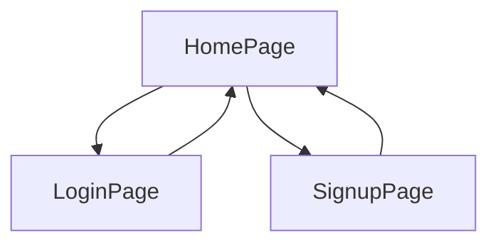

## What work you need to do to finish Sulaiman project

1. Get the minimal app working on hosted environment and on phone if possible
2. Keep the timing that is by Friday on 13th
3. Keep all work under on main folder so that you do not need to open it from somewhere else.
4. Keep the working project under this project too.
5. keep writing the what yo u are doing in readme.md as you keep forgetting what you are doing. 
6. Do not waste time in building images, copy paste and provide the references to the originals.
7. Keep one format of your work do not follow what others have done than later on use the heading and arrange it so that it makes sense.
8. Get Sulaiman to understand what is happening on Sunday at least once, as he will be asked to demonstrate as it appears to be the highest level of work of his capabilities.

---


### Requirements for such a project


1. Websites typically follow a client-server architecture, where the client refers to the user's web browser (such as Chrome, Firefox, or Safari), and the server refers to a remote computer that hosts the website's files and data. When a user visits a website, their browser sends a request to the server, asking for the website's content. These request uses HTTP verbs such as `GET` method for the page navigation.
2. Similarly when a user submits a form on a webpage (such as a login form, registration form, or search form), the browser sends a request to the server to process the form data. This request can use either the HTTP GET or POST method, depending on the form's configuration and the type of data being submitted.
3. Web pages often contain resources such as images, stylesheets, scripts, and fonts that are loaded asynchronously from the server. Each of these resources triggers a separate request to the server, allowing the browser to fetch and render them independently while the rest of the page loads.
4. Modern web applications frequently interact with remote APIs (Application Programming Interfaces) to retrieve data, perform actions, or integrate with external services. These API requests can be initiated from the client side using various techniques, such as AJAX, the fetch API, or client-side libraries/frameworks.
5. All the above usually refers to a term commonly known as `Client/Server` architecture.  
6. **Client-Side Activities**: Client-side activities refer to tasks and operations that are performed within the user's web browser. This includes rendering HTML, executing JavaScript code, and handling user interactions such as clicks and form submissions. Client-side activities are responsible for creating the user interface and providing interactivity to the user.
7. **Server-Side Activities**: Server-side activities, on the other hand, are performed on the server, typically using server-side technologies like Node.js. These activities include processing user requests, executing business logic, interacting with databases, and generating dynamic content. Server-side activities are responsible for handling the backend operations of the application, such as user authentication, data validation, and database management.
8. **Role of Node.js in Client-Server Communication**:Node.js plays a crucial role in facilitating communication between the client-side and server-side components of web applications. It serves as the backend infrastructure for handling client requests, processing data, and sending responses back to the client. By leveraging the power of Node.js, developers can build fast, scalable, and real-time web applications that deliver a seamless user experience across different devices and platforms. 

#### Why Node.js?

1. **JavaScript Everywhere**: With Node.js, developers can use JavaScript for both client-side and server-side development, enabling a consistent and unified codebase.
2. **Event-Driven Architecture**: Node.js utilizes an event-driven, non-blocking I/O model, which allows for efficient handling of concurrent requests and real-time applications.
3.**Vibrant Ecosystem**: Node.js has a large and active community, providing a wealth of libraries and tools to streamline development.
4. **Scalability**: Node.js applications can easily scale to handle large numbers of concurrent connections, making it suitable for building robust and scalable web applications.

#### How a simple nodejs server is created?

The following code creates  a simple nodejs server that is run locally for developing environment.

```js
// Import the 'http' module
const http = require('http');
// Define the hostname and port number
const hostname = '127.0.0.1';
const port = 3000;
// Create a server
const server = http.createServer((req, res) => {
  // Set the response status and headers
  res.statusCode = 200;
  res.setHeader('Content-Type', 'text/plain');
  // Send the response
  res.end('Hello, World!\n');
});
// Start the server and listen for incoming requests
server.listen(port, hostname, () => {
  console.log(`Server running at http://${hostname}:${port}/`);
});

```

The above code does the followings:

1. Require the built-in http module, which provides functionality for creating HTTP servers using `const http = require('http');`. Declaring some variables for the port and hostname and assigned them some values.
2. Uses the `http.createServer()` method to create a server instance. Pass a callback function to handle incoming requests.
3. Within the callback function, handle incoming HTTP requests. This involves reading request data, processing it, and sending back a response.
4. Specify the port number on which the server should listen for incoming requests.

Similarly the same can be done using a nodejs module called `express` since it provides number of functionalities to ease the job it is also known as express framework. Following code shows how the same job is done using express module.

```js 
// Import the Express framework
const express = require('express');
// Create an Express application
const app = express();
// Define a route handler for the root path
app.get('/', (req, res) => {
  // Send a response
  res.send('Hello, World!\n');
});
// Define the port number
const port = 3000;
// Start the server and listen for incoming requests
app.listen(port, () => {
  console.log(`Server running on port ${port}`);
});
```
If we see the above code closely there is not much difference except that express module is used and GET request is handled by a route. This is not we intend to achieve from express but we want our code to be modular and properly structured. For this purpose we use an MVC ( modal view controller ) architecture where components of a websites are treated separately.

#### MVC ( MOdel-View-controller) architecture

- it is a design pattern commonly used in software development to organize code and separate concerns.

- **Model**: The model represents the data and business logic of the application. It encapsulates the application's data and defines how it can be manipulated.In a database-driven web application, models often interact with the database to perform CRUD (Create, Read, Update, Delete) operations.View:

- **View**: The view is responsible for presenting the user interface and displaying data to the user. It renders the model's data in a format suitable for presentation, such as HTML, XML, or JSON. Views are typically passive components that receive data from the controller and display it to the user. 

- **Controller**: The controller acts as an intermediary between the model and the view. It handles user input and updates the model accordingly. Controllers contain the application's business logic, process user requests, and determine which view to render in response.

#### Key Principles

1. Separation of Concerns: MVC separates the application logic into distinct components, making it easier to understand, maintain, and extend.
2. Modularity: Each component (model, view, controller) can be developed, tested, and modified independently, promoting code reusability and scalability.
3. Flexibility: MVC allows for flexible interaction between components, enabling developers to change one component without affecting others.
4. Scalability: The modular structure of MVC facilitates the development of large-scale applications by dividing them into manageable parts.

Overall, MVC architecture provides a robust foundation for building complex software systems by promoting separation of concerns, modularity, and flexibility. It remains a popular choice for developing web applications due to its clear structure and well-defined responsibilities for each component. For this reason I have decided to use this pattern and develop this project.

### Application design

- Since the project promises to provide the full functional website its design is structured in steps. At first we only design the site to provide us the working websites that includes a home page providing the option of `Login` and `Signup` facilities. Once this stage is passed, testing is done,we will continue to the next stage.
- The project also promises that such a project should be used on mobile devices, thus it would try to achieve this functionality using Progressive Web App technologies before going to the next stage.

#### Design: Part-A

- The first part is to achieve this goal to make a website that simply provide the user to Login or Register them to the website.



### Implementation of the design Part-A

- In MVc architecture `views` represents the interface or the webpages that user can interact with. When users presses or clicks on these interfaces client initiates the request to navigate to a different page, this requests is handled by the MVC architecture using `routes`. Similarly what is to be done in response to the request can be handled by the `controller` components.
- Express frame work makes our job easy to keep all these components of the web developing environment by providing us separate folders to keep the work modular while working behind the scene providing the logic to interact with each other.


### Starting project

1. VSCode has been set up with the required extensions activated.
2. Node.js, npm, and Git have been installed.
3. GitHub has been chosen as the platform for uploading work, with an account under the username 'SulaimanSayyed21' already created.
4. An empty remote repository with the same name has been created to connect with the local machine.
5. The next step involves configuring the Express framework.


#### Setting up express nodejs framework

- Though the folder structured can be created manually but `express` provides a CLI (command line interface) to ease the work.
- To use the express cli, it has been installed using `npm install -g express-generator`.
- Express allows us to use different templating engine for the html code, I have chosen `ejs` as my template engine.

#### Generating the application skeleton

1. The command `express --view=ejs h446` creates a skeleton folder structure. The out put is shown below.

```txt
> express --view=ejs h446                                       pwsh  12:53:12 

   create : h446\
   create : h446\public\
   create : h446\public\javascripts\
   create : h446\public\images\
   create : h446\public\stylesheets\
   create : h446\public\stylesheets\style.css
   create : h446\routes\
   create : h446\routes\index.js
   create : h446\routes\users.js
   create : h446\views\
   create : h446\views\error.ejs
   create : h446\views\index.ejs
   create : h446\app.js
   create : h446\package.json
   create : h446\bin\
   create : h446\bin\www

   change directory:
     > cd h446
   install dependencies:
     > npm install
   run the app:
     > SET DEBUG=h446:* & npm start

```
- Following is the listing of this directory.

```txt
Directory: K:\projects\2024\express\h446
Mode                LastWriteTime         Length Name
----                -------------         ------ ----
d----        08/04/2024     12:53                  bin
d----        08/04/2024     12:53                  public
d----        08/04/2024     12:53                  routes
d----        08/04/2024     12:53                  views
-a---        08/04/2024     12:53           1074   app.js
-a---        08/04/2024     12:53            290   package.json
```

- The application project folder name is provided above as `h446`. the above command also sets the html templating engine to be `ejs`.

#### Initialising git and linking it to the GitHub repo

1. First we initialised the `git`into the `h446` folder, using the following command.
2. Second contents of the folder are added to staging area.
3. The commit is made giving some comments.

```git
> git init .
> git aa 
> git cm "initial commit: express app generated using express cli setting templating engine as ejs"
```

> Note: in above command git aa and cm are git aliases set by me to ease the work, the details of these shortcuts  will be provided in the Appendix

- Taking a git log shows the out put of repo state.

```git
> git log
commit 50e4c936f0a8cb1783dd76e199da7e1ac346f487 (HEAD -> main)
Author: SulaimanSayyed21 <sullisayyed21@outlook.com>
Date:   Mon Apr 8 12:59:25 2024 +0100
```

- Link is established between local and remote repository using `git remote add origin https://github.com/SulaimanSayyed21/h446Alevel.git`.
- Setting a branch name `git branch -M main`.
- Pushing the local repo to remote using `git push -u origin main`.
- The out put is shown below.

```git
 > git push -u origin main
Enumerating objects: 15, done.
Counting objects: 100% (15/15), done.
Delta compression using up to 16 threads
Compressing objects: 100% (12/12), done.
Writing objects: 100% (15/15), 2.56 KiB | 523.00 KiB/s, done.
Total 15 (delta 1), reused 0 (delta 0), pack-reused 0
remote: Resolving deltas: 100% (1/1), done.
To github.com-SulaimanSayyed21:SulaimanSayyed21/h446Alevel.git
 * [new branch]      main -> main
branch 'main' set up to track 'origin/main'.
```

- Having pushed the local repo to the remote, following is the snapshot of the remote repo.


- Express framework has created a `project.json` file which contents are shown below.

```json
{
  "name": "h446",
  "version": "0.0.0",
  "private": true,
  "scripts": {
    "start": "node ./bin/www"
  },
  "dependencies": {
    "cookie-parser": "~1.4.4",
    "debug": "~2.6.9",
    "ejs": "~2.6.1",
    "express": "~4.16.1",
    "http-errors": "~1.6.3",
    "morgan": "~1.9.1"
  }
}
```
- The above has set the name of the app along with other information. A script is provided to run the application. In dependencies folder it telss us that this project depends upon these libraries. They are not yet installed. The first step is to install them by using `npm install`.
- When this command is run, npm install all the libraries under `node_modules` folder. It is time to see if our skeleton app is working or not.
- Using `npm run start` the script is started at `port 3000`.
- Terminal output is shown below.

```txt
> npm run start
> h446@0.0.0 start
> node ./bin/www

GET / 200 88.382 ms - 207
GET /stylesheets/style.css 200 5.964 ms - 111
GET /sw.js 404 3.356 ms - 993
GET / 200 2.621 ms - 207
GET /stylesheets/style.css 200 2.111 ms - 111
GET /favicon.ico 404 2.472 ms - 993
```

- The above information shows us that server is run from `./bin/www` directory amd different `Get` requests are made, the last one status shows `404` means that there was no `favicon` found. As the project goes along details will be provided of what is happening.
- The server snapshot is shown below. 


- At this state we install another npm library called `nodemon` so that while we work the server is updated. The nodemon watches any live changes in the code and as the files are saved it updates the server without letting us stop and restart the server.
- To do so we use `npm i nodemon`. It can be installed globally or locally in this project. I have installed it globally as it helps me in other projects.
- Adding a script in `project.json` file using this line of code `"dev":"nodemon --ext js,ejs,json,css ./bin/www"`. It lets us start the script using `npm run dev` where the word `dev` represents our development environment while the script `nodemon --ext js,ejs,json,css` are instructions given to nodemon to watch the changes in these file.
- Staring the server using `npm run dev`, following is the output of this command.

> If you clone this repo you will need to install nodemon using `npm install nodemon` to get the script working.

```txt
> npm run dev
> h446@0.0.0 dev
> nodemon --ext js,ejs,json,css ./bin/www

[nodemon] 3.1.0
[nodemon] to restart at any time, enter `rs`
[nodemon] watching path(s): *.*
[nodemon] watching extensions: js,ejs,json,css
[nodemon] starting `node ./bin/www`
```
- Since we have added the node_modules and it is a git project we create a `.gitignore` file so that node_modules is not included in our project. It is a common practice as it includes thousand of libraries folders. When anyone else clone this repository, one has to only run `npm install` and all dependencies are installed and project can be run. Also adding `Readme.md` file.
- Readme.md is a markdown file which can be rendered on any browser, it frees you to write contents in html file using different elements as `<h1>` etc.
- A commit is made to save the state of the repository.

> Note: So far we have created a nodejs express skeleton app that gives us a server which is running on the local machine on the port 3000. No code for the required app is written.

### Analysing the express skeleton structure

- The first job for us to understand and analyse how express server is working. Where and how our webpages to be written, where are styles and JavaScript code along with other static files such as images if we have any, are to be placed.
- Second writing the logic or code for our application. Also deciding in which folder it has to go and how to provide the logic for express to understand what we intend to do so that it can work accordingly.
- Let see what folder structure is created by express for us, it is shown below using the `tree /F` command on terminal.

```txt
K:.
│   app.js
│   package.json
│
├───bin
│       www
│
├───public
│   ├───images
│   ├───javascripts
│   └───stylesheets
│           style.css
│
├───routes
│       index.js
│       users.js
│
└───views
        error.ejs
        index.ejs
```
---


- The above structure tells us that the main application name is `app.js` which is present at the root of our project.
- Public folder is a place where static files are to be placed. static files are the one which are not changed dynamically when the application is run.
- Views provide the place where html pages are to be written and kept. It is the frontend part of the client/sever architecture.
- Routes folder where routing logic is to be created for the navigation of the pages. It represents the backend of the client/server architecture.
- The bin directory has a www file without any extensions but it is js script which creates the server, since it is created by an express server it provides the logic ro `run, debug and listen to the server along with any error detailed if encountered. Following is code from this file.

> Note: It was possible to delete all the contents provided by the express framework and starts writing the logic from the beginning but it would have been useless as express only provides the basic logic which we would have to write again. To delete and write the same code is not a good practice in software engineering and referred as reinventing the wheel.

```js
#!/usr/bin/env node

var app = require('../app');
var debug = require('debug')('h446:server');
var http = require('http');

var port = normalizePort(process.env.PORT || '3000');
app.set('port', port);

var server = http.createServer(app);

server.listen(port);
server.on('error', onError);
server.on('listening', onListening);

function normalizePort(val) {
  var port = parseInt(val, 10);
  if (isNaN(port)) {
    // named pipe
    return val;
  }
  if (port >= 0) {
    // port number
    return port;
  }
  return false;
}

function onError(error) {
  if (error.syscall !== 'listen') {
    throw error;
  }
  var bind = typeof port === 'string'
    ? 'Pipe ' + port
    : 'Port ' + port;
  // handle specific listen errors with friendly messages
  switch (error.code) {
    case 'EACCES':
      console.error(bind + ' requires elevated privileges');
      process.exit(1);
      break;
    case 'EADDRINUSE':
      console.error(bind + ' is already in use');
      process.exit(1);
      break;
    default:
      throw error;
  }
}

function onListening() {
  var addr = server.address();
  var bind = typeof addr === 'string'
    ? 'pipe ' + addr
    : 'port ' + addr.port;
  debug('Listening on ' + bind);
}
```
---

#### Interrogating the Functionality of the www Script

**Shebang**: `#!/usr/bin/env node` - This line specifies that the script should be executed by the Node.js runtime. The symbol `#!` is shell environment is known as `Shebang` and must be the first part of the first line of the script for the script to run successfully.

**Module Dependencies**: The script requires necessary modules:
   - `var app = require('../app');`: This imports the `app.js` from the root folder.
   - `var debug = require('debug')('h446:server')`: This is used for debugging prupose providing the name for our root folder.
   - `var http = require('http');`: To use the http object for the server to start it gets the handle to the node built in `http` module.
  
 **Get Port**: The script attempts to obtain the port number from the environment variables. If not found, it defaults to port 3000. This port number is then set on the Express application.

**Create HTTP Server**: The script creates an HTTP server using the `http.createServer()` method and passes the Express application (`app`) to it.

**Event Listeners**: 
   - `server.on('error', onError)`: Listens for any errors that occur when starting the server.
   - `server.on('listening', onListening)`: Listens for when the server starts listening for connections.

**Normalize Port Function**: This function attempts to normalize the provided port into a number, string, or false by using if logic and checking different possible situations.

**Error Handling**: The `onError` function handles errors that occur when starting the server, such as permission issues or port conflicts. It also provides the logic by having a `switch` statement and displays the code using `console.error` function.

**Listening Event Handling**: The `onListening` function logs a message indicating that the server is listening on a specific port or pipe.

> Note: in short express has provided much more sophisticated logic to handle the errors and encountering possible mistakes. The same task was earlier provided by simple logic as shown above under the heading "How a simple nodejs server is created.

#### Examining app.js code

- It is the main entry point for an Express application. It is where the application is configured, routes are defined, middleware is applied, and the server is started. Lets examine this code.

```js
var createError = require('http-errors');
var express = require('express');
var path = require('path');
var cookieParser = require('cookie-parser');
var logger = require('morgan');

var indexRouter = require('./routes/index');
var usersRouter = require('./routes/users');

var app = express();

// view engine setup
app.set('views', path.join(__dirname, 'views'));
app.set('view engine', 'ejs');

app.use(logger('dev'));
app.use(express.json());
app.use(express.urlencoded({ extended: false }));
app.use(cookieParser());
app.use(express.static(path.join(__dirname, 'public')));

app.use('/', indexRouter);
app.use('/users', usersRouter);

// catch 404 and forward to error handler
app.use(function(req, res, next) {
  next(createError(404));
});

// error handler
app.use(function(err, req, res, next) {
  // set locals, only providing error in development
  res.locals.message = err.message;
  res.locals.error = req.app.get('env') === 'development' ? err : {};

  // render the error page
  res.status(err.status || 500);
  res.render('error');
});

module.exports = app;
```

1. The code begins by requiring necessary modules such as` http-errors, express, path, cookie-parser, and logger`. These modules are used for handling errors, creating the Express application, working with file paths, parsing cookies, and logging requests. This is how the node application works using CommonJs model syntax. In contrast to CommonJs ES6 uses `import/export` syntax to achieve the same goal.
2. Next, it requires route files for handling different parts of the application. indexRouter and usersRouter are required from their respective route files (./routes/index and ./routes/users). The index routes represents our home page and can be accessed using `http:<URL>/` or `http:<url>index`, as we are using localhost on port 3000, we will get our home page using `localhost:3000` respectively.
3. An instance of Express application is created and stored in the variable `app` using `var app = express()`.
4. Express is configured to use the EJS view engine. The views directory is set to `views`, and the view engine is set to `ejs`.
5. Middleware functions are applied to the Express application using the `app.use()` method. in short wherever express uses `app.use()` this format is used to setup the middleware. All the above defined middleware `use` methods are handled by the express internally hese include:
  - `logger('dev')`: Configures logging middleware with the 'dev' format..
  - `app.use(express.json()) and app.use(express.urlencoded({ extended: false }))`: Middleware for parsing JSON and URL-encoded request bodies.
  - `cookieParser()`: Parsing cookies attached to incoming requests.
  - `express.static()`: Serving static files from the 'public' directory.


6. `app.use('/', indexRouter)`: Mounts the index router at the root URL ('/'). This route is to be handled by us or the developer to provide the logic what happens when the home page is served.
Similarly `app.use('/users', usersRouter)`: Mounts the users router at the '/users' URL. It is up to us to use this or delete this logic.
7. `app.use(function(req, res, next) { ... })`: Handles 404 errors by passing them to the next middleware. 

>Note: The function arguments `req` means the request and `res` means the response sent when receiving the request while `nex` represent what is to be done next, in above case it invokes the `createError(404)`method.

8. `app.use(function(err, req, res, next) { ... })`: It is a central error-handling middleware which sets the error status, renders an error page, and sends an error response.

9. `module.exports = app`: Exports the Express application to make it available to other modules.

Overall, app.js sets up an Express application, configures middleware, defines routes, and handles errors to create a robust web server.

#### What lies under views folder ? 

1. As mentioned earlier it is this folder which represents the front end of our website. Express provides us with two files. One is `error.js` which contains nothing but three lines logic to show the error messages and express uses this file to show an error if encounters. The code is shown below.

```ejs
<h1><%= message %></h1>
<h2><%= error.status %></h2>
<pre><%= error.stack %></pre>
```

> Note: Since we are using ejs templating engine its notation `<% %> or <%- %> or <%= %>` is used in above code. We will leave this file as it is.

2. The second file is `index.ejs` which serves as our home page. Earlier when we ran our server the website snap shot shown above gives us the message defined in this page. Following is the code for this file. We do not intend to use this file and its contents will be deleted. 

```html
<!DOCTYPE html>
<html>
  <head>
    <title><%= title %></title>
    <link rel='stylesheet' href='/stylesheets/style.css' />
  </head>
  <body>
    <h1><%= title %></h1>
    <p>Welcome to <%= title %></p>
  </body>
</html>
```

Before we start to work we will also see what is present in our `route` folder.

#### What is present is route folder ? 

The route folder has two files containing the code of handling the navigation of home page and the users. We first look at the index.js or home page routing code.

```js
var express = require('express');
var router = express.Router();

/* GET home page. */
router.get('/', function(req, res, next) {
  res.render('index', { title: 'Express' });
});

module.exports = router;
```

1. The code begins by importing the express module and creating a new router instance using express.Router().
2. ext a route is defined using the get() method of the router object. This route handles `HTTP GET` requests to the root path ('/').
3. The route callback function takes three parameters req (request), res (response), and next.
4. Inside the route handler function, the `res.render()` method is used to render the index view template with some data. In this case, it sets the `title` variable to `Express`.
5. Finally, the router object is exported using `module.exports`, making it available for use in other parts of the application.

In short this route serves as the handler for the home page ('/') of the Express application, rendering the index view template and passing it the title 'Express'. Having done with the route folder it takes us to the one more file provided by the express framework in `public/stylesheet/styles.css`. It is used to provide some styles, we are not going to use this file and contents of this file will be deleted.


```css
body {
  padding: 50px;
  font: 14px "Lucida Grande", Helvetica, Arial, sans-serif;
}

a {
  color: #00B7FF;
}
```
- Express does not provide any script so the javascript folder is empty.


> Note: So far we have examined the express skeleton structure and the code provided. The next step is to provide the logic for our intended website.

---

###

